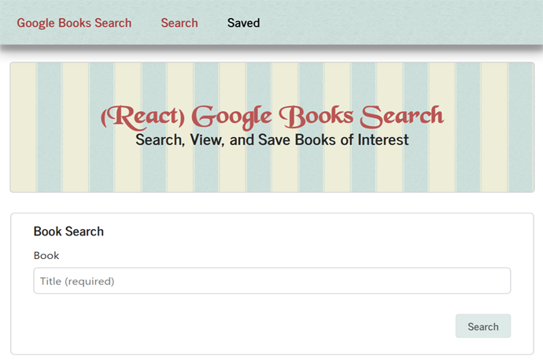

<h1 align="center">Google Book Search</h1>

<kbd></kbd>
 

This project is a Google book search application.  It allows users to search the Google Books API by title, save books to a database, view book details, and preview the books.  

# Demo
*https://young-everglades-79214.herokuapp.com/ 
# Setup
In order to run the app, you will need to clone this repository and install all required technologies listed below.
# Required Technologies
1. [Node.js LTS](https://nodejs.org/en/) 
2. [NPM](https://www.npmjs.com/get-npm) 
3. [Git & Git Bash](https://git-scm.com/downloads) 
4. [MongoDB](https://docs.mongodb.com/manual/tutorial/install-mongodb-on-windows/) 
5. [Robo 3T](https://robomongo.org/download) 

# NPM Modules Used
1. react
2. react-dom
3. react-scripts
4. axios
5. express
6. mongoose
7. if-env

# Installation Steps
1. Open Bash and Clone the Reading-List repo
2. Install all required technologies
3. [Optional] In Bash, change the current directory to the reading-list directory and install create-react-app module using the following command:
    1. npm install -g create-react-app
4. In Bash, change to the reading-list directory, install all modules from the package.json, using the following command:
    1. npm install [Enter] 
# Execute Program
1. In Bash, enter the following command in the reading-list directory, to start the server.
    1. npm start [ENTER]
2. The application will open your browser and run the app in test mode:
    1. http://localhost:3000
# Use
This repo is available for public non-commercial use only.
# Goal
The goal of this project is to create and deploy a MERN application, consisting of a server and a Single Page Application (SPA), using React. The server stores and retrieves data from our API using MongoDB and displays content to the client, via the UI. The UI is broken into React components, that manage and transfer state, and responds to user events. 
